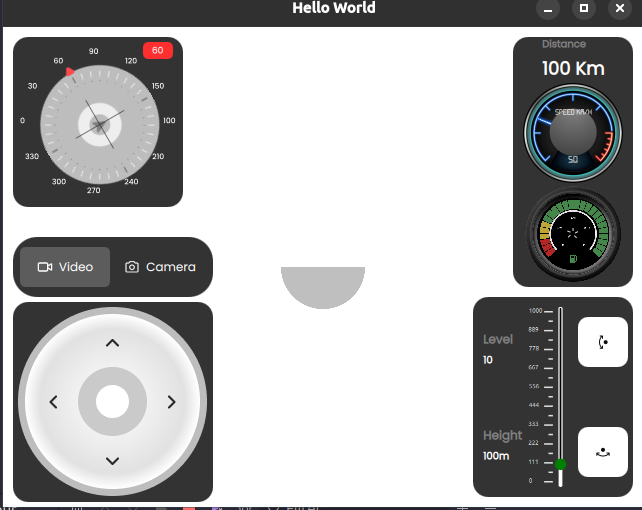

# DroneControllerPlugin




## example
**cpp code**

```Qt
      DroneCore::instance().setBattery(100);
        DroneCore::instance().setDistance(100);
        DroneCore::instance().setLevel(10);
        DroneCore::instance().setHeading(60);
        DroneCore::instance().setSpeed(50);
       DroneCore::instance().setRtsp(QUrl(""));
        QObject::connect(&DroneCore::instance(),&DroneCore::moveFront,[](double i){
           qDebug()<< i;
       });
       QObject::connect(&DroneCore::instance(),&DroneCore::heightChange,[](double i){
           qDebug()<< i;
       });
```
**Qml Code**
```Qml
    import QtQuick
    import Drone 1.0
    Window {
        width: 640
        height: 480
        visible: true
        title: qsTr("Hello World")
        DroneItem{
            anchors.fill :parent
        }

}
```
